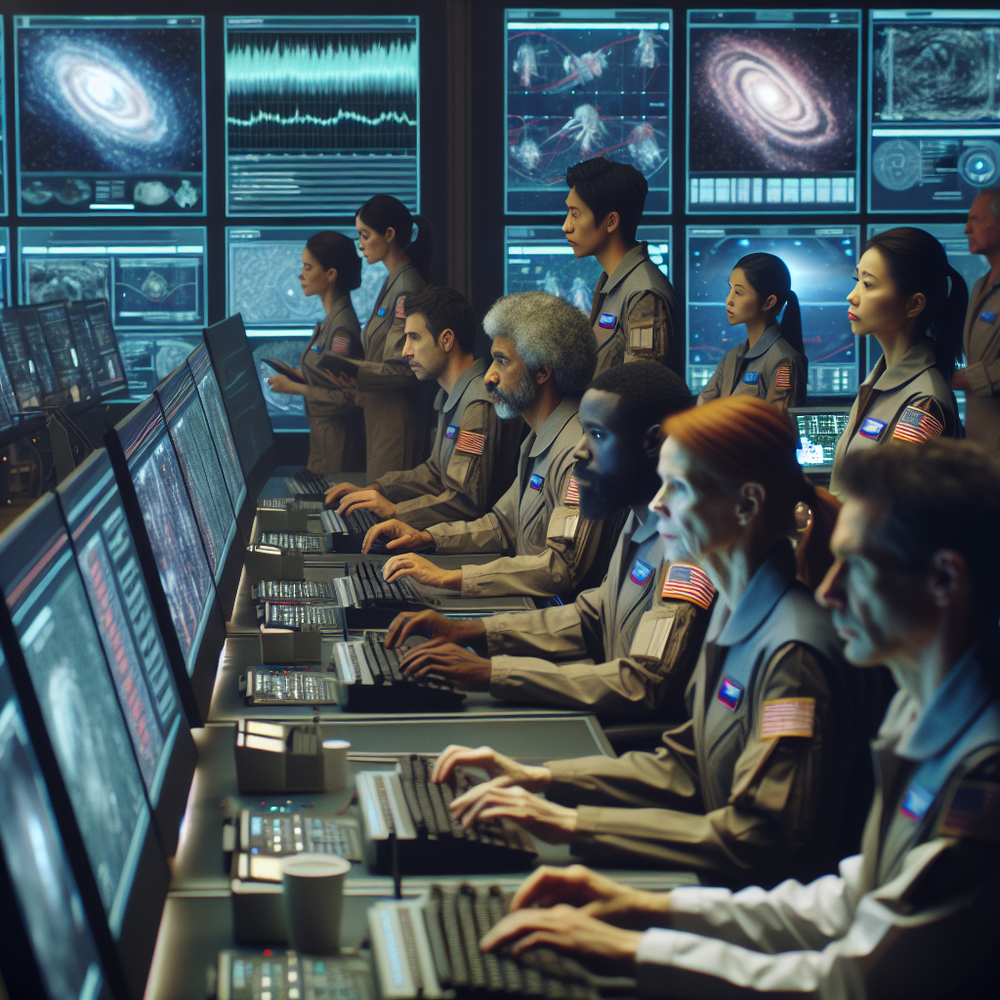

# Challenge 01 - Consolidate and Stabilize

[Home](../README.md) - [Next Challenge >](Challenge-02.md)

## Introduction

The Quantum Seeker is smoothly cruising through space, with its systems operating flawlessly. The crew is preparing for the final phase of their mission when suddenly, the ship's alarms blare. A cosmic storm of unprecedented magnitude is detected, and it’s too late to change course. The storm hits, causing severe disruptions across the ship’s infrastructure. Key systems start malfunctioning: life support fluctuates, navigation systems go haywire, resource allocation becomes erratic. The root cause of these issues is traced back to fragmented and inconsistent Terraform configurations spread across multiple projects.

Your team has been tasked with a critical mission: consolidate all Terraform configurations into a single, unified project to restore stability and ensure the Quantum Seeker can complete its mission.

## Success Criteria

- Your repo has a folder containing as many .tf files as you have team members. 
- Each .tf contains all infrastructure configuration (RG+VNET+VM) belonging to respective member
- provider.tf defined only once.
- Terraform is initialized in your group folder

[Home](../README.md) - [Next Challenge >](Challenge-02.md)