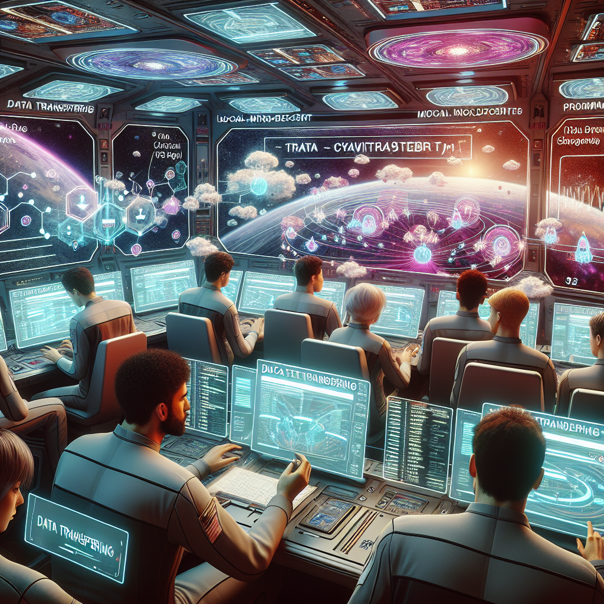

# Challenge 02 - Galactic Terraform Cloud

[< Previous Challenge](Challenge-01.md) - [Home](../README.md)

## Introduction

The crew realizes their local Terraform setup is vulnerable to cosmic anomalies. Command decides to migrate the ship’s infrastructure management to the more resilient and centralized Galactic Terraform Cloud.

## Success Criteria

- Your team has a workspace in HCP Terraform
- Version Control System (VCS) integration between GitHub repo and TF Workspace is setup and works
- Local terminal of each team member is connected to the HCP Terraform and uses remote state
- You are not able to apply infrastructure changes via console

## HINT

- Dont forget env variables! They are shared in Teams.
- Dont forget to modify provider.tf by **adding** [Terraform Cloud block](../files/provider.tf)

##  Resources

- [HCP Terraform Portal (dont use corp accounts!)](https://app.terraform.io)
- [Login to HCP Terraform via CLI](https://developer.hashicorp.com/terraform/tutorials/cloud-get-started/cloud-login)
- [Connect HCP Terraform to GitHub](https://developer.hashicorp.com/terraform/cloud-docs/vcs/github-app#using-github-repositories)
- [What are HCP Terraform workspaces](https://developer.hashicorp.com/terraform/cloud-docs/workspaces)
- [Create environmental variables in HCP Terraform](https://developer.hashicorp.com/terraform/tutorials/cloud-get-started/cloud-create-variable-set)
- [Migrate state to HCP Terraform](https://developer.hashicorp.com/terraform/tutorials/cloud/cloud-migrate)

[< Previous Challenge](Challenge-01.md) - [Home](../README.md) 
