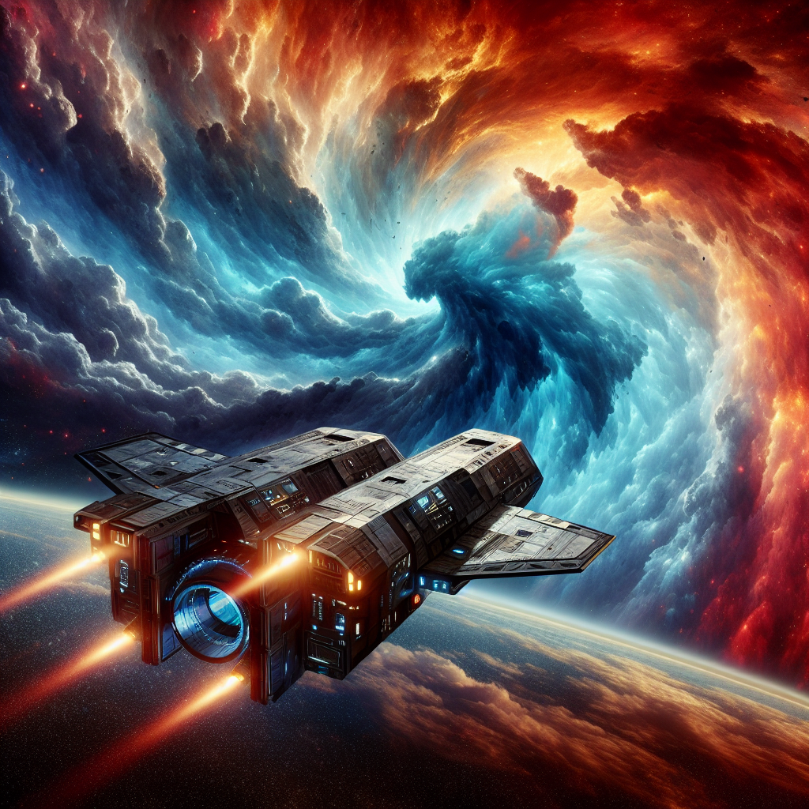

# Marchaton #3 - The Innovation Summit

## Introduction

In the third and the last episode of Marchaton the Quantum Seeker starship continues its critical mission. However, during its journey through the cosmos, the ship encounters a massive cosmic storm that causes severe configuration drifts in its infrastructure. The crew must swiftly act to restore stability, migrate their local systems to the centralized Galactic Terraform Cloud, and modularize their code for future-proofing their mission.

## Learning Objectives

By the end of this workshop, participants will be able to:

- Understand the benefit of remote Terraform state management and integration of Terraform with VCS.

## Challenges
- Challenge 1: **[Consolidate and Stabilizie](Challenges/Challenge-01.md)**
   - Consolidating fragmented configurations.
- Challenge 2: **[Galactic Terraform Cloud](Challenges/Challenge-02.md)**
   - Establishing a centralized management platform for IaC.

## Contributors
- Dmitrii Tyryshkin
- Christoph Günther
- GPT-4o

## Inspiration
- [Microsoft WhatTheHack](https://microsoft.github.io/WhatTheHack/)
- [Hera Space Mission](https://www.heramission.space/)